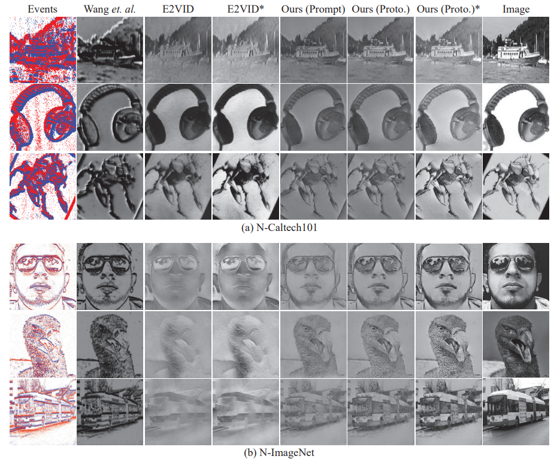
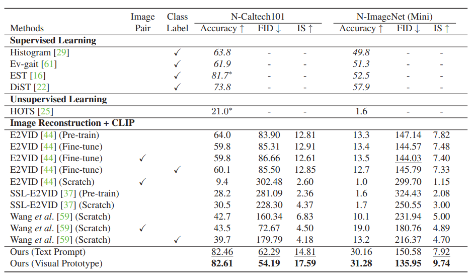

# Ev-LaFOR (ICCV 2023 Oral)

This repository contains the official PyTorch implementation of the paper "Label-Free Event-based Object Recognition via Joint Learning with
Image Reconstruction from Events" paper (ICCV 2023, Oral).
\[[Paper](https://openaccess.thecvf.com/content/ICCV2023/papers/Cho_Label-Free_Event-based_Object_Recognition_via_Joint_Learning_with_Image_Reconstruction_ICCV_2023_paper.pdf)\] 


## Qualitative Results on N-Caltech101 and N-ImageNet100 datasets



### Quantitative results on N-Caltech101 and N-ImageNet100 datasets



## Requirements
* CLIP (https://github.com/openai/CLIP)


## Training & Test Code

Train & Test on N-Caltech 101 Dataset

```bash
    $ python pretraining_event_with_prototype_caltech.py -en $experiment_name$ -d caltech_ours --ssl_spatial --inverse --n_mask 6
```


Train & Test on N-ImageNet 100 Dataset

```bash
    $ python pretraining_event_with_prototype_imagenet.py -en $experiment_name$ -d imagenet100 --ssl_spatial --inverse --n_mask 6
```

You can also use the multi prototype by adding the --multi_proto


## Reference
> Hoonhee Cho*, Hyeonseong Kim*, Yujeong Chae, and Kuk-Jin Yoon "Label-Free Event-based Object Recognition via Joint Learning with Image Reconstruction from Events", In _ICCV_, 2023.
```bibtex
@inproceedings{cho2023label,
  title={Label-Free Event-based Object Recognition via Joint Learning with Image Reconstruction from Events},
  author={Cho, Hoonhee and Kim, Hyeonseong and Chae, Yujeong and Yoon, Kuk-Jin},
  booktitle={Proceedings of the IEEE/CVF International Conference on Computer Vision},
  pages={19866--19877},
  year={2023}
}
```

##

## Contact
If you have any question, please send an email to hoonhee cho (gnsgnsgml@kaist.ac.kr)

## License
The project codes and datasets can be used for research and education only. 
